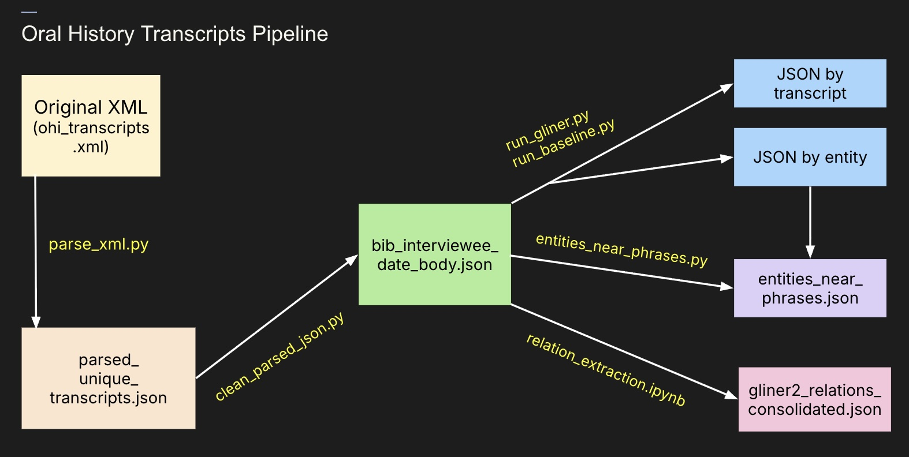

# Unifying Multimodal Collections held by the American Institute of Physics

### A Humanities Data Science Summer Institute (HDSSI 2026) Project

This repository contains the computational pipelines developed during the 2026 Humanities Data Science Summer Institute (HDSSI) in collaboration with the American Institute of Physics (AIP). 

Our project explores how natural language processing and computer vision can improve discoverability across two archival collections: the **Niels Bohr Library Oral History Transcripts** and the **Emilio Segrè Visual Archives**.

The overall goal is to create computational methods that help archivists and researchers discover hidden relationships and identify historically underrecognized contributors to physics. 

---

## Repository Overview

The repository consists of two independent pipelines:

### 1. Oral History Transcript Pipeline

- Parses and cleans XML oral history transcripts into structured JSON for downstream analysis.
- Applies Named Entity Recognition (NER) to identify people, organizations, institutions, locations, and other entities mentioned throughout the interviews.
- Performs relation extraction to identify semantic relationships between entities and consolidate them across the entire corpus.
- Generates knowledge graphs and summary statistics to visualize collaborations, institutional networks, and recurring relationships.
- Supports humanities research by surfacing potentially underrecognized contributors through phrase-based entity analysis and relational exploration.

- Generates CLIP image embeddings to produce semantic representations of archival photographs.
- Applies DBSCAN clustering to group visually similar images without requiring labeled training data.
- Uses zero-shot concept labeling to assign descriptive categories to images using natural language prompts.
- Produces t-SNE visualizations for qualitative evaluation of the learned embedding space and clustering results.
- Supports archival discovery by organizing large image collections into meaningful visual and semantic groupings.

