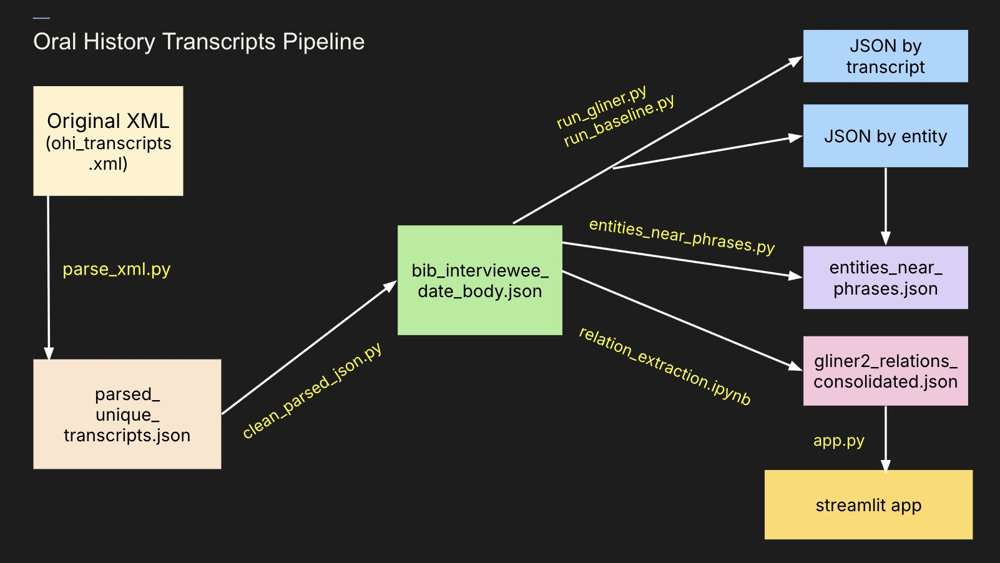
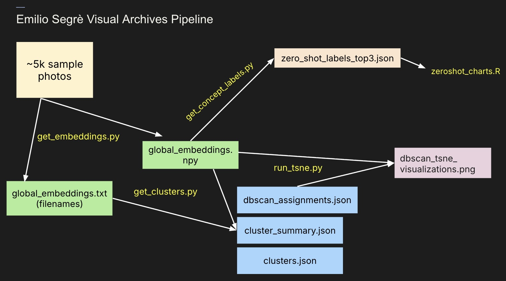
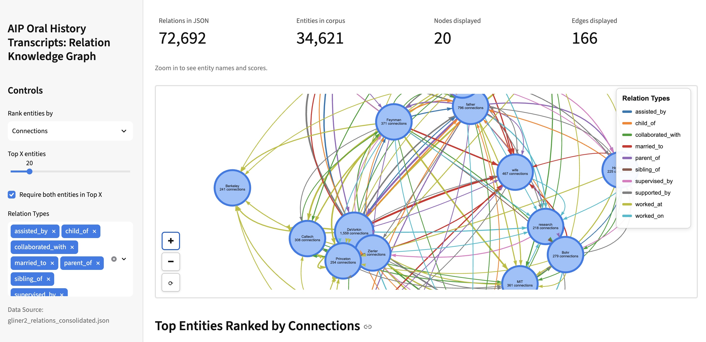

# Unifying Multimodal Collections held by the American Institute of Physics

### A Humanities Data Science Summer Institute (HDSSI 2026) Project

This repository contains the computational pipelines developed during the 2026 Humanities Data Science Summer Institute (HDSSI) in collaboration with the American Institute of Physics (AIP). 

Our project explores how natural language processing and computer vision can improve discoverability across two archival collections: the **Niels Bohr Library Oral History Transcripts** and the **Emilio Segrè Visual Archives**.

The overall goal is to create computational methods that help archivists and researchers discover hidden relationships and identify historically underrecognized contributors to physics. 

## Repository Overview

The repository consists of two independent pipelines:

### 1. Oral History Transcript Pipeline

1. Parses and cleans XML oral history transcripts into structured JSON for downstream analysis.
2. Applies Named Entity Recognition (NER) to identify people, organizations, institutions, locations, and other entities mentioned throughout the interviews.
3. Performs relation extraction to identify semantic relationships between entities and consolidate them across the entire corpus.
4. Generates knowledge graphs and summary statistics to visualize collaborations, institutional networks, and recurring relationships.

1. Generates CLIP image embeddings to produce semantic representations of archival photographs.
2. Applies DBSCAN clustering to group visually similar images without requiring labeled training data.
3. Uses zero-shot concept labeling to assign descriptive categories to images using natural language prompts.
4. Produces t-SNE visualizations for qualitative evaluation of the learned embedding space and clustering results.
5. Supports archival discovery by organizing large image collections into meaningful visual and semantic groupings.

## Resources

- **`requirements.txt`**  
  Lists the Python packages and package versions required to reproduce all analyses.

- **`methodology.md`**  
  Provides a detailed description of the computational methodology, including the parameters, processing pipeline, and example outputs for:
  - DBSCAN clustering
  - CLIP-based zero-shot concept labeling
  - GLiNER2 relation extraction
  - Knowledge graph construction

- **`knowledge_graph_app/app.py`**  
  Streamlit application for interactively exploring the extracted entity relationship knowledge graph.
  

## Project Impact

Scientific discovery is shaped not only by well-known researchers, but also by the students, collaborators, family members, technicians, and institutions that support their work. Much of this information is embedded within archival collections and can be difficult to identify and explore using traditional search methods alone.

The computational pipelines developed in this project generate structured representations of entities, relationships, and visual content from large archival collections. These outputs can serve as a foundation for downstream analyses, enabling researchers and archivists to explore collaboration networks, investigate recurring themes, identify potentially underrecognized contributors, and examine patterns across thousands of oral history transcripts and archival photographs.

More broadly, this project illustrates how natural language processing and computer vision can be applied to support archival research workflows. These methods provide computational tools that can help organize large collections, facilitate discovery, and generate new avenues for exploration by archivists, historians, and other researchers.

## Project Team

This project was completed as part of the University of Washington **2026 Humanities Data Science Summer Institute (HDSSI)** in collaboration with the **American Institute of Physics (AIP)**.

**Primary Investigator**
- Benjamin Lee

**Graduate Student Research Assistant**
- Hannah Sun

**Undergraduate Researchers**
- Christian Alviz
- Priya Devanesan
- Phoebe Norton
- Rebekah Song

We thank the AIP archivists and HDSSI organizers for their guidance, feedback, and support throughout the project.
