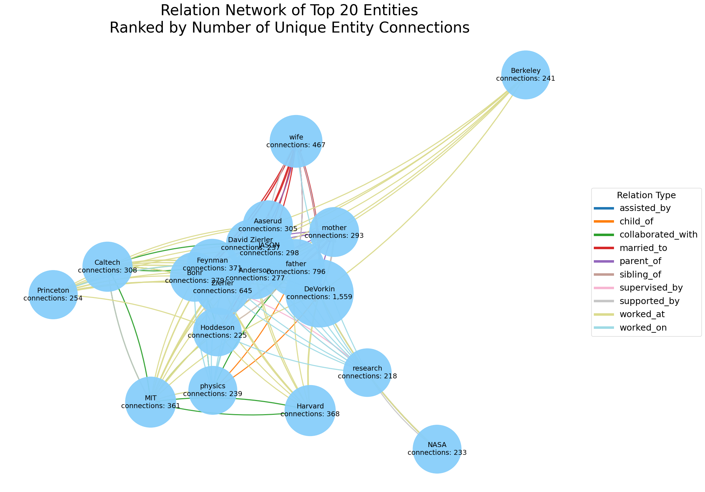
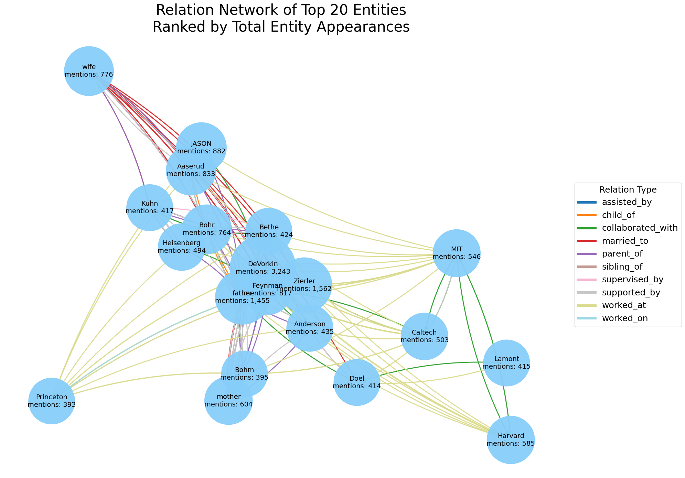
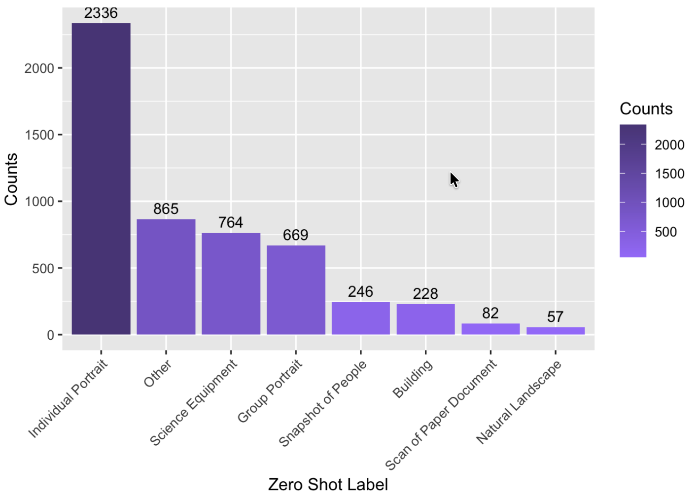

# Methodologies

## Table of Contents

- [GLiNER2 Relation Extraction](#gliner2-relation-extraction)
- [DBSCAN Clustering](#dbscan-clustering)
- [Zero-Shot Concept Labeling](#zero-shot-concept-labeling)

## GLiNER2 Relation Extraction

### Overview

The relation extraction pipeline is implemented in [`relation_extraction.ipynb`](relation_extraction.ipynb). The notebook identifies semantic relationships between entities mentioned throughout the oral history collection. Whereas Named Entity Recognition (NER) identifies individual entities (people, organizations, locations, etc.), relation extraction builds upon these entities, identifying **how they are connected**. We then construct knowledge graphs to visualization these relationships.

One of GLiNER2's distinguishing features is that it performs open-schema relation extraction. Instead of being limited to a fixed set of predefined relation labels, we are able to provide the relation types we want the model to look for at inference time. Our custom set of labels is as follows:

* `collaborated_with`
* `supervised_by`
* `worked_at`
* `worked_on`
* `supported_by`
* `assisted_by`
* `married_to`
* `parent_of`
* `child_of`
* `sibling_of`

The resulting structured data can be used to analyze collaborations, institutional networks, scientific careers, and underrecognized contributors across the archive.

For each relation type, we supply a `description` explaining what the relation means. GLiNER2 uses this text to understand the semantics of the relation label. For example, instead of only seeing the label `sibling_of`, the model also sees: `Family relationship between two named siblings, including brothers and sisters.` 

Additionally, the `threshold` is the minimum confidence score required for GLiNER2 to keep a predicted relation.

---

The `relation_extraction.ipynb` notebook is designed to run in **Google Colab** using a **GPU** runtime.

Using an A100 GPU, relation extraction across all **1,754 unique oral history transcripts** completes in approximately **2 hours**.

Model Used: `fastino/gliner2-base-v1`

The notebook performs the following steps:

1. Loads the cleaned transcript dataset (`bib_interviewee_date_body.json`).
2. Splits transcript text into overlapping chunks due to model context window limitations and relation extraction quality.
3. Runs GLiNER2 relation extraction on every chunk.
4. Consolidates duplicate relation triples extracted from multiple chunks. A relation triple consists of `(head entity, relation, tail entity)`, for example: `(Richard Feyman, worked_at, Los Alamos)`.
5. Aggregates corpus-wide statistics.
6. Generates visualizations summarizing extracted relationships.
7. Builds an interactive knowledge graph of highly connected entities.

---

The primary output is:

```
extracted_relations/
└── gliner2_relations_consolidated.json
```

The dataset contains **72,692 unique extracted relations**.

Each JSON object represents one unique relation triple aggregated across the entire corpus.

Each record contains the following fields.

| Field                  | Description                                                                                                 |
| ---------------------- | ----------------------------------------------------------------------------------------------------------- |
| `relation`             | Type of relationship (e.g. `"worked_at"`).                                                                  |
| `head`                 | Source entity.                                                                                              |
| `tail`                 | Target entity.                                                                                              |
| `transcript_count`     | Number of unique transcripts in which the relation appears.                                                 |
| `total_count`          | Total number of occurrences across all transcripts, including repeated mentions within the same transcript. |
| `counts_by_transcript` | Dictionary mapping transcript bib numbers to occurrence counts.                                             |
| `examples`             | List containing at most one representative extraction example.                                              |

The `counts_by_transcript` dictionary has the structure:

```
{
    "48389": 2,
    "47291": 1,
    ...
}
```

where:

* key = transcript bib number
* value = number of occurrences within that transcript

Each example contains:

| Field              | Description                                              |
| ------------------ | -------------------------------------------------------- |
| `field_bib_number` | Transcript bib number.                                   |
| `interviewee`      | Interviewee name.                                        |
| `interview_date`   | Interview date.                                          |
| `chunk_index`      | Chunk from which the relation was extracted.             |
| `head_confidence`  | Confidence score for the head entity (currently set to `null`). |
| `tail_confidence`  | Confidence score for the tail entity (currently set to `null`). |
| `context`          | Text snippet from which the relation was extracted.      |


Although the parsing code supports relation outputs containing entity confidence scores, the GLiNER2 model used in this project returned relations as `(head, tail)` pairs without confidence metadata. Our analysis focused on the extracted relationships rather than entity-levevl confidence estimates. Consequently, the `head_confidence` and `tail_confidence` fields are stored as `null` in the output JSON.

---

The notebook computes corpus-wide statistics, including:

* Distribution of extracted relation types
* Most frequent relation triples
* Relations ranked by total occurrence count
* Relations ranked by number of transcripts in which they appear

These summaries help identify the most common relationship patterns throughout the archive.

---

To visualize our extracted relations, we opted for:

### Knowledge Graphs

Each provides a high-level view of important people, organizations, laboratories, projects, and other entities while illustrating how they are connected.

#### Nodes

Each node represents an extracted entity. Node size reflects the selected ranking metric. Each node is annotated with its ranking score. Two ranking metrics are available: **frequency** and **connectivity**. 

Frequency ranks entities by the total number of extracted relation occurrences involving that entity. This highlights entities that appear most frequently throughout the corpus. Connectivity ranks entities by the number of unique entities directly connected to them. This highlights entities that serve as hubs within the relationship network.

#### Edges

Each directed edge represents one extracted relationship between two entities. Edge colors correspond to different relation types. Edge thickness is proportional to the total number of times that specific triple was extracted across the corpus. 

#### Entity Selection

To improve readability, only the **Top X entities** are displayed.

Entities may be selected using either frequency or connectivity.

#### Graph Filtering

Two visualization modes are available.

1. Require Both Entities in Top X

Only relationships where **both entities** belong to the selected Top X are displayed.

This produces a compact graph showing the strongest relationships among the highest-ranked entities.

2. Require At Least One Entity in Top X

Relationships are displayed whenever **either endpoint** belongs to the Top X.

This reveals how highly ranked entities connect to the broader network while preserving additional context. **Note: when this option is selected, graphs take substantially longer time to generate.**

---

We generated the following knowledge graph visualizations for the 20 entities ranked highest by frequency and connectivity:

### Example Outputs





---

## DBSCAN Clustering

---

## Zero-Shot Concept Labeling

### Overview

The zero-shot concept labeling pipeline utilizes OpenAI's CLIP model to embed 512 dimenensions on each individual image, mapping them onto a vector space. This allows for images to be compared against a set of custom user-defined labels, enabling for zero-shot concept labeling of all images without the need for user training. In our usecase, we utilize a custom set of labels that broadly categorizes the images into different types, that allow us to better understand the make up of the input image dataset. 

Our custom set of labels is as follows:

* 	`Individual Portrait`
* 	`Group Portrait`
* 	`Natural Landscape`
* 	`Science Equipment`
* 	`Building`
*	`Scan of Paper Document`
*	`Snapshot of People`

The result of this pipeline is a JSON file that labels all images under one of our custom labels, lists the model's second and third ranked labels, and the confidence score associated with each prediction. Additionally, a `threshold` value is set, which is the minimum confidence score that is required for the label to be assigned to a corresponding image, otherwise the image is labeled as `other`.

---

The zero-shot concept labeling pipeline is ran in the following steps.

1. `get_embeddings.py` embeds each image utilizing OpenAI's CLIP model. This produces a `global_embeddings.npy`.
2. `get_concept_labels.py` takes in a set of custom labels.
3. Each image's embeddings are then compared to each label, and is assigned a confidence score for each label.
4. The top three labels for each image are then attached to each image's corresponding json object.
5. The highest confidence label is checked against the `threshold` score. If greater, the image is assigned to that label, otherwise it is assigned as `other`.
6. `zero_shot_labels_top3.json`is output, containing a set of JSON objects, with each representing an image, and the model's label prediction. 
7. `zero_shot_chart.R` aggregates the JSON objects and creates a bar chart visualization, showcasing the number of images assigned to each label.

--- 

The primary output is:

```
embeddings/
└── zero_shot_labels_top3.json
```

This dataset contains a JSON object that represents each individual image within the input image dataset, with the following fields.

| `filename` | Name of the file in the original image dataset. |
| `assigned_label` | The label that the is assigned to the image (highest confidence label, or `other` if less than confidence threshold). | 
| `raw_top1_label` | The highest confidence label, regardless of threshold value |
| `raw_top1_score` | The confidence score of the highest confidence label. |
| `other_threshhold` | The threshold value the image must pass before being assigned the `other` label.|
| `top3` | List containing the top 3 labels that each image is assigned, in order of confidence score.

Each object within the `top3` list contains the following fields:

    | `label` | The label as defined by the set of custom labels. |
    | `score` | The confidence score of the model of that specific label. |

---

To visualize our labels, we utilized a bar chart, with each column representing a label within our set.

`zero_shot_chart.R`, takes in the JSON file `zero_shot_labels_top3.json` produced from `get_concept_labels.py`, and creates a bar chart visualization by aggregating the image's corresponding JSON objects by their `assigned_label`. The final bar chart visualizes the raw number of each label assigned to the dataset.

### Example Outputs




